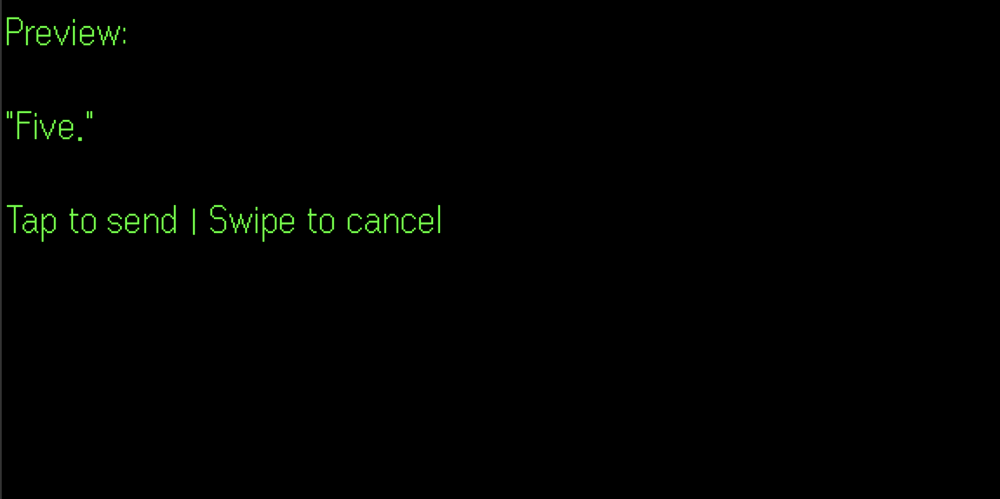

# even-bridge

Speech-to-Messenger plugin for Even G2 smart glasses.

Record speech, which gets transcribed via OpenAI Whisper and sent to your messenger chat. Supports **Telegram**, **Slack**, and **Gmail**.

## Screenshots

<table>
  <tr>
    <td align="center"><strong>Messenger Select</strong></td>
    <td align="center"><strong>Contact List</strong></td>
  </tr>
  <tr>
    <td></td>
    <td></td>
  </tr>
  <tr>
    <td align="center"><strong>Conversation</strong></td>
    <td align="center"><strong>Send Preview</strong></td>
  </tr>
  <tr>
    <td></td>
    <td></td>
  </tr>
</table>

## Architecture

```
[G2 Glasses] --BLE--> [Phone WebView] --WebSocket--> [Node.js Server]
                                                           |
                                                    [OpenAI Whisper API]
                                                           |
                                                    [Messenger API]
                                              (Telegram / Slack / Gmail)
```

The app uses the G2 web-proxy model: the server hosts a web page, the Even App (iOS or Android) loads it in a WebView, and the glasses act as a BLE display + input peripheral. The SDK injects `EvenAppBridge` into the WebView for JavaScript-to-native communication.

## How It Works

1. **Tap to start** — glasses display startup screen with the Even Bridge logo.
2. **Select messenger** — choose between Telegram, Slack, Gmail, or any other configured messenger. Only messengers configured in Settings are shown.
3. **Select contact** — scroll through your contacts and tap to select who to send the message to. The last contacted person is remembered.
4. **Double tap to record** — the G2 microphone opens (`bridge.audioControl(true)`) and streams raw PCM audio (16kHz, 16-bit, mono) over WebSocket to the server.
5. **Tap to stop** — another tap closes the mic, the server converts accumulated PCM to WAV and sends it to OpenAI Whisper for transcription.
6. **Messenger delivery** — the transcribed text is sent to the selected contact via your chosen messenger. The glasses display a confirmation with a preview.

## G2 SDK Details

| Feature | Implementation |
|---|---|
| Audio format | PCM S16LE, 16kHz, mono, 10ms frames (40 bytes each) |
| Mic control | `bridge.audioControl(true/false)` |
| Audio data | `audioEvent.audioPcm` (Uint8Array) via `bridge.onEvenHubEvent()` |
| Display | Single `TextContainerProperty` container (576x288px) |
| Display updates | `textContainerUpgrade` for in-place text changes |
| Input | `CLICK_EVENT` (0) — handled with `=== 0 \|\| === undefined` quirk |
| Display limits | 1000 chars at startup, 2000 via upgrade |

## Setup

```bash
npm install
npm run dev
```

Open `http://localhost:3000` in your browser. On first launch you'll be redirected to Settings (gear icon in the header) to configure your credentials.

### Settings UI

All credentials are managed through the browser-based Settings UI. No need to edit `.env` — it's only used for app-level config like `PORT`.

| Setting | Where to get it |
|---|---|
| **OpenAI API Key** | [platform.openai.com](https://platform.openai.com) — required for speech-to-text |
| **Telegram API ID & Hash** | [my.telegram.org](https://my.telegram.org) — create an app to get credentials |
| **Slack User Token** | [api.slack.com/apps](https://api.slack.com/apps) — see [Slack Setup](#slack-setup) |
| **Gmail Address & App Password** | Google Account > Security > App passwords — see [Gmail Setup](#gmail-setup) |

You need at least one messenger configured. You can configure all three — the app will let you choose at startup.

### Telegram Setup

1. Go to [my.telegram.org](https://my.telegram.org) and create an app to get your API ID and Hash.
2. Enter them in Settings > Telegram and click Save.
3. Click **Authenticate**, enter your phone number, then the verification code sent to your Telegram app. If you have 2FA enabled, you'll be prompted for your password.
4. After authentication, the session is saved and you won't need to re-authenticate.

### Slack Setup

1. Go to [api.slack.com/apps](https://api.slack.com/apps) and click **Create New App** → **From scratch**.
2. Name it (e.g., "G2 Bridge") and select your workspace.
3. Go to **OAuth & Permissions** and add these **User Token Scopes**:
   - `channels:history` — read messages in public channels
   - `channels:read` — list public channels
   - `chat:write` — send messages
   - `groups:history` — read messages in private channels
   - `groups:read` — list private channels
   - `im:history` — read DM messages
   - `im:read` — list DMs
   - `mpim:history` — read group DM messages
   - `mpim:read` — list group DMs
   - `users:read` — resolve user display names
4. Click **Install to Workspace** and authorize.
5. Copy the **User OAuth Token** (`xoxp-...`) and paste it in Settings > Slack.

Messages are sent as your user account, just like Telegram.

### Gmail Setup

1. Enable **2-Step Verification** on your Google Account.
2. Go to [Google Account > Security > App passwords](https://myaccount.google.com/apppasswords).
3. Generate a new app password (select "Mail" or "Other").
4. Enter your Gmail address and the 16-character app password in Settings > Gmail.

Gmail uses IMAP for reading (folders, messages) and SMTP for sending replies.

## Run

```bash
npm run dev       # development with hot reload
npm run dev:sim   # development with hot reload + G2 simulator
npm run build     # compile TypeScript
npm start         # run compiled output
```

## Testing

**Browser fallback** — open `http://localhost:3000` in your browser. The app detects no G2 bridge and falls back to using your computer's microphone via the Web Audio API. Click the record button to test the full flow.

**G2 glasses** — deploy the server to a public URL (or use a tunnel like ngrok) and set the app URL in the Even App on your iPhone or Android device.

## Project Structure

```
docs/
  screenshots/                         G2 display screenshots
CLAUDE.md                              Project instructions for AI agents
.claude/
  rules/
    code-style.md                      Auto-loaded coding standards
  skills/
    g2-sdk/SKILL.md                    G2 glasses SDK reference (auto-triggered)
    design-system/SKILL.md             UI design tokens & components (auto-triggered)
src/
  server.ts                            Composition root — HTTP + WebSocket server
  app.ts                               Express app setup and route registration
  websocket.ts                         WebSocket message handling
  routes/
    api.ts                             Main API routes (messengers, contacts, messages)
    settings.ts                        Settings API (credentials CRUD, Telegram auth)
  services/
    audio.ts                           OpenAI Whisper transcription (lazy init)
    settings.ts                        Settings storage (settings.json + env fallback)
    telegramAuth.ts                    Telegram web-based auth state machine
    lastRecipient.ts                   Last contacted person persistence
  messengers/
    types.ts                           Messenger interface and shared types
    telegram.ts                        Telegram implementation (GramJS)
    slack.ts                           Slack implementation (@slack/web-api)
    gmail.ts                           Gmail implementation (IMAP + SMTP)
    index.ts                           Messenger factory and availability check
  public/
    index.html                         Frontend UI (CSS + HTML shell + Settings)
    js/
      main.js                          App initialization and event wiring
      state.js                         State machine and navigation
      api.js                           HTTP API client functions
      recording.js                     Audio recording (G2 mic + browser fallback)
      ws.js                            WebSocket client
      history.js                       Message history
      utils.js                         Shared utilities
      ui/
        browser.js                     Browser DOM rendering
        glasses.js                     G2 glasses display rendering
    logo-data.json                     Logo encoded for G2 display
    telegram-icon-data.json            Telegram icon for G2 display
    slack-icon-data.json               Slack icon for G2 display
    gmail-icon-data.json               Gmail icon for G2 display
  scripts/
    pngEncoder.ts                      PNG encoder with CRC32/Adler32 checksums
    generateSlackIcon.ts               Slack icon generator
```

## Tech Stack

- **Server** — Express, WebSocket (`ws`), TypeScript
- **Speech-to-text** — OpenAI Whisper API
- **Telegram** — GramJS (Telegram Client API, sends as your user account)
- **Slack** — @slack/web-api (Slack Web API, sends as your user account)
- **Gmail** — imapflow (IMAP) + nodemailer (SMTP)
- **G2 SDK** — `@evenrealities/even_hub_sdk`
